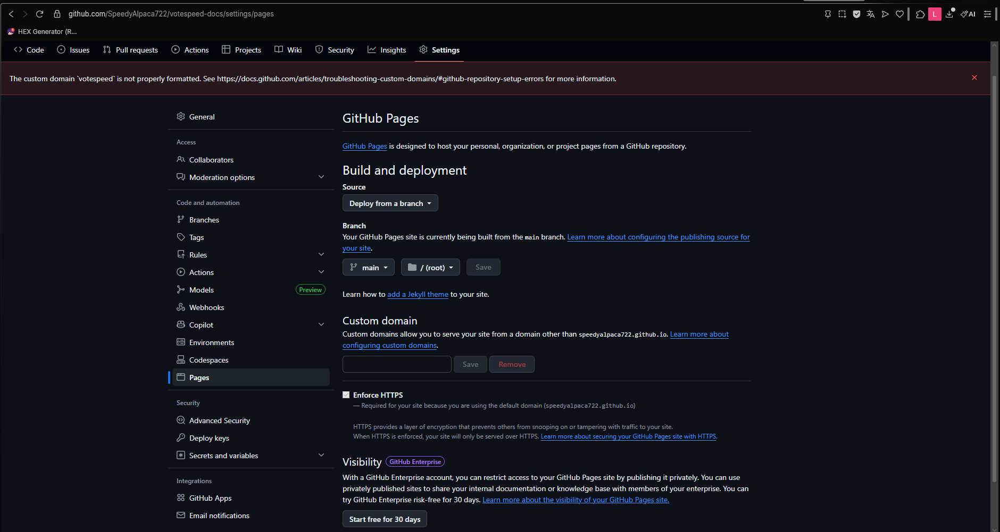

](image.png)# Table of Contents

* [Welcome](README.md)

## Getting Started

* [Installation](getting-started/installation.md)
* [Quick Start](getting-started/quick-start.md)
* [Choosing Your JAR](getting-started/choosing-your-jar.md)

## Configuration

* [Main Config (config.yml)](configuration/config.md)
* [Vote Sites (sites.yml)](configuration/sites.md)
* [Vote Shop (shop.yml)](configuration/shop.md)
* [Vote GUI (gui.yml)](configuration/gui.md)
* [Rewards (rewards.yml)](configuration/rewards.md)
* [Language Files](configuration/language.md)

## Features

* [Vote Points & Shop](features/vote-points-and-shop.md)
* [Vote Streaks](features/vote-streaks.md)
* [VoteParty](features/voteparty.md)
* [Top Voters](features/top-voters.md)
* [Vote Reminders](features/vote-reminders.md)
* [Vote Effects](features/vote-effects.md)
* [Discord Webhook](features/discord-webhook.md)

## Commands & Permissions

* [Player Commands](commands/player-commands.md)
* [Admin Commands](commands/admin-commands.md)
* [Proxy Commands](commands/proxy-commands.md)
* [Permissions](commands/permissions.md)

## Integrations

* [PlaceholderAPI](integrations/placeholderapi.md)
* [Economy (Vault / VaultUnlocked)](integrations/economy.md)
* [LuckPerms](integrations/luckperms.md)
* [Crate Plugins](integrations/crate-plugins.md)
* [TokenManager](integrations/tokenmanager.md)
* [Custom Item Plugins](integrations/custom-items.md)
* [DiscordSRV](integrations/discordsrv.md)

## Advanced

* [Proxy Setup (BungeeCord / Velocity)](advanced/proxy-setup.md)
* [Bedrock Support (Geyser / Floodgate)](advanced/bedrock-support.md)
* [Database (MySQL / SQLite)](advanced/database.md)
* [External Reward Files](advanced/external-rewards.md)
* [Placeholders Reference](advanced/placeholders-reference.md)

## Support

* [FAQ](support/faq.md)
* [Troubleshooting](support/troubleshooting.md)
